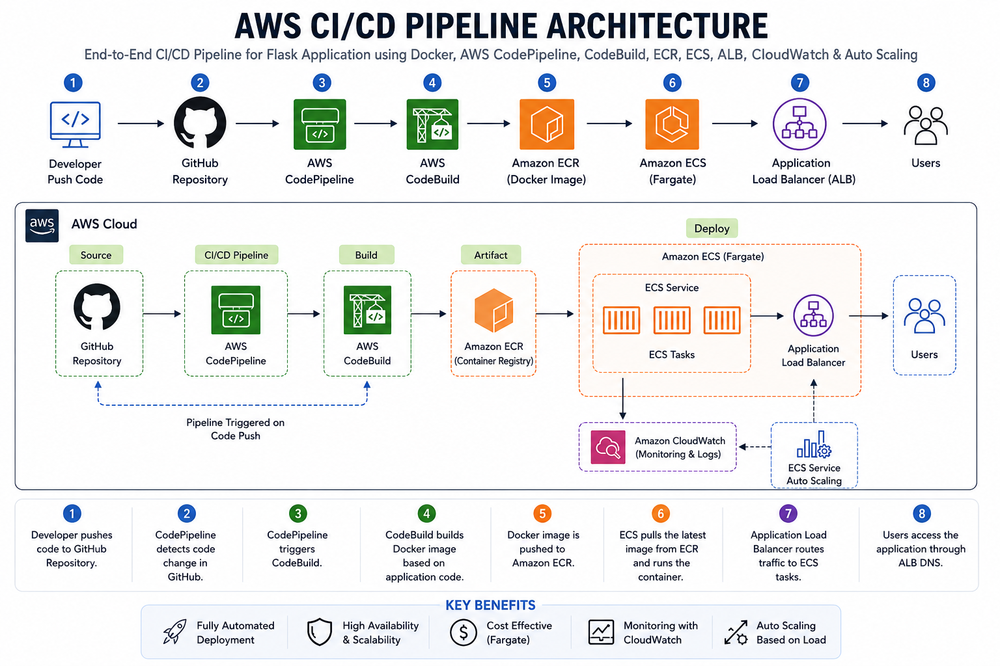
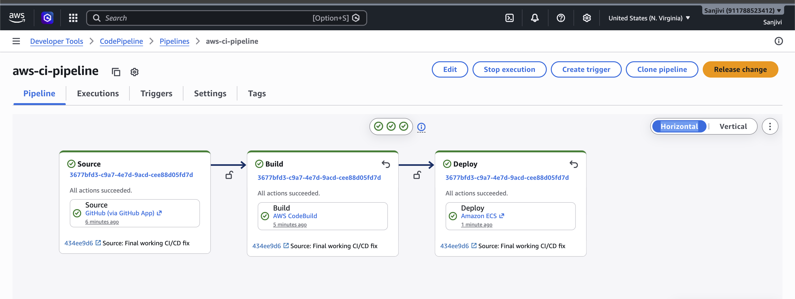
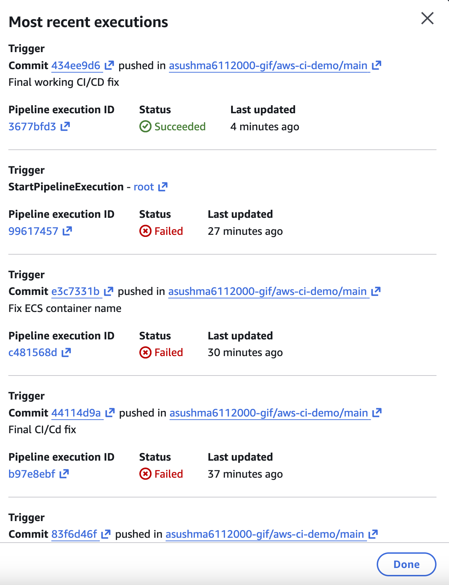
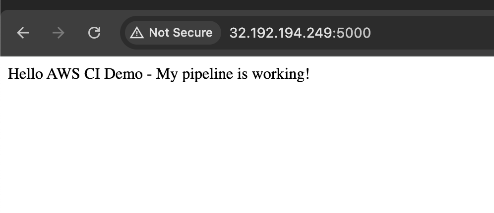
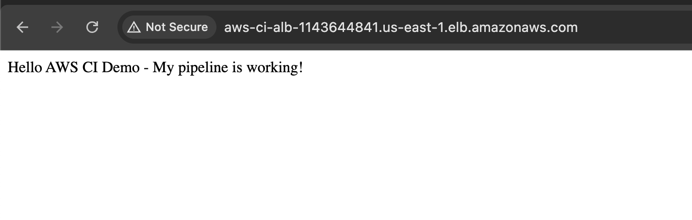

# AWS CI/CD Pipeline Project (Flask + Docker + ECS + ALB + Auto Scaling + CloudWatch)

## Project Overview

This project demonstrates a complete CI/CD pipeline using AWS services.  
A simple Flask application was containerized using Docker and automatically deployed to Amazon ECS using AWS CodePipeline and AWS CodeBuild.

The project was enchanced by integrating an Application Load Balancer (ALB), ECS Auto Scaling, and Amazon CloudWatch monitoring to improve application availability, scalability, and observability.

The goal of this project was to understand end-to-end CI/CD workflow, Docker deployment, ECS service deployment, ALB integration, Auto Scaling configuration, CloudWatch monitoring, and troubleshooting real AWS deployment issues.

## Architecture Diagram



---

## Architecture Flow

Developer Push Code  
↓  
GitHub Repository  
↓  
AWS CodePipeline  
↓  
AWS CodeBuild  
↓  
Docker Image Build  
↓  
Amazon ECR  
↓  
Amazon ECS (Fargate) 
↓  
Application Load Balancer (ALB)
↓ 

Users Access Flask Application
↓

cloudWatch Monitoring -> ECS Service Auto
Scaling -> Scale In / Scale Out ECS Tasks

---

## Technologies Used

- Python Flask
- Docker
- Git
- GitHub
- AWS CodePipeline
- AWS CodeBuild
- Amazon ECR
- Amazon ECS
- Application Load Balancer (ALB)
- Amazon CloudWatch
- Auto Scaling

---

## Deployment Workflow

1. Developer pushes source code changes to GitHub
2. AWS CodePipeline automatically detects repository changes
3. Source artifact is sent to AWS CodeBuild
4. CodeBuild executes instructions from `buildspec.yml`
5. Docker image is built from the Flask application
6. Docker image is tagged and pushed to Amazon ECR
7. `imagedefinitions.json` artifact is generated
8. Amazon ECS service receives the new image definition
9. ECS launches new task revision
10. CloudWatch monitors ECS metrics
11. Auto Scaling adjusts task count based on workload
12. Application Load Balancer routes traffic to healthy ECS tasks
13. Application becomes accessible through ALB DNS

---

## Buildspec Workflow

The build process is defined inside `buildspec.yml`.

### pre_build

- Authenticate Docker with Amazon ECR using AWS CLI
- Set repository URI and image tag
- Prepare environment variables required for build

### build

- Build Docker image from Dockerfile
- Tag Docker image with latest tag

### post_build

- Push Docker image to Amazon ECR
- Generate `imagedefinitions.json`
- Export build artifact for ECS deployment

---

## Project Structure

```bash
.
├── app.py
├── Dockerfile
├── requirements.txt
├── buildspec.yml
├── architecture-diagram.png
├── screenshots/
│   ├── pipeline-success.png
│   ├── deploy-troubleshooting.png
│   ├── ecs-running-app.png
│   └── alb-dns-running-app.png
└── README.md
```

---

## Docker Build Process

The application is containerized using Docker.

### Dockerfile Responsibilities

- Use Python base image
- Copy application files
- Install dependencies
- Expose application port
- Run Flask application

---

## AWS Services Used

### AWS CodePipeline
Automates the complete CI/CD workflow.

### AWS CodeBuild
Builds Docker images and pushes them to Amazon ECR.

### Amazon ECR
Stores Docker container images securely.

### Amazon ECS
Runs the containerized Flask application.

### Application Load Balancer (ALB)
Distributes incoming traffic and routes requests to healthy ECS tasks.

### Amazon CloudWatch
Monitors ECS CPU and memory metrics and triggers alarms.

### Auto Scaling
Automatically increases or decreases ECS task count based on CloudWatch metrics.

---

## Troubleshooting & Fixes

### 1. Source Provider Configuration Issue

**Issue:**  
GitHub Version 2 was not visible during pipeline creation.

**Fix:**  
Used GitHub connection via GitHub App / CodeConnections.

**Result:**  
Source stage was configured successfully.

---

### 2. Deploy Stage Failed

**Issue:**  
Source and Build stages succeeded, but Deploy stage failed.

**Root Cause:**  
Container name inside `imagedefinitions.json` did not match ECS task definition.

**Fix:**  
Updated container name to match ECS exactly.

Example:

```json
[
  {
    "name": "aws-ci-demo-container",
    "imageUri": "<ECR_IMAGE_URI>"
  }
]
```

**Result:**  
Deployment moved forward successfully.

---

### 3. ECR Repository Configuration Issue

**Issue:**  
Confusion while adding the correct Amazon ECR repository URI in `buildspec.yml`.

**Fix:**  
Configured correct ECR repository URI and image tagging.

**Result:**  
Docker image pushed successfully to Amazon ECR.

---

### 4. Deploy Stage Took Long Time

**Issue:**  
Deploy stage remained in progress for several minutes.

**Root Cause:**  
Amazon ECS waits for the new task to become healthy and service to reach steady state.

**Fix:**  

- Verified ECS task status = RUNNING
- Checked deployment status
- Reviewed ECS service events

**Result:**  
Deployment completed successfully.

---

### 5. Application Accessibility Verification

**Issue:**  
Needed to verify whether Flask application was accessible.

**Fix:**  

- Security group allowed inbound traffic on port 5000
- Flask application listens on:

```python
app.run(host="0.0.0.0", port=5000)
```

**Result:**  
Application became accessible via ECS public IP.

---

### 6. Application Load Balancer Access Issue

**Issue:**  
Application was not accessible through ALB DNS.

**Root Cause:**  
HTTP port 80 traffic was blocked by ALB Security Group.

**Fix:**  

- Allowed inbound HTTP traffic on port 80 from `0.0.0.0/0`
- Verified ALB listener configuration
- Verified target group health checks
- Confirmed ECS tasks were healthy

**Result:**  
Application became accessible successfully through ALB DNS.

---

### 7. Auto Scaling Configuration Issue

**Issue:**  
Scaling policy was not triggering initially.

**Root Cause:**  
CloudWatch alarm and scaling policy were not properly attached to ECS service.

**Fix:**  

- Configured ECS Service Auto Scaling
- Set minimum and maximum task count
- Attached CloudWatch CPU utilization alarm

**Result:**  
Auto Scaling successfully adjusted task count based on workload.

---

## Application Access

Application was successfully accessible through Application Load Balancer DNS.

Example:

```bash
http://<alb-dns-name>
```

---

## Screenshots

### Pipeline Success


### Deployment Troubleshooting


### ECS Public IP Running Application


### ALB DNS Running Application


---

## Key Learnings

- Built end-to-end AWS CI/CD pipeline
- Learned Docker image creation and deployment
- Understood Amazon ECR and ECS integration
- Practiced debugging real AWS deployment issues
- Learned ALB configuration and networking troubleshooting
- Learned CloudWatch monitoring and alerting
- Configured ECS Auto Scaling policies
- Gained hands-on DevOps troubleshooting experience

---

## Future Improvements

- Enable HTTPS using ACM
- Configure custom domain with Route 53
- Add Blue/Green deployment strategy

---

## Project Status

Project completed successfully.
