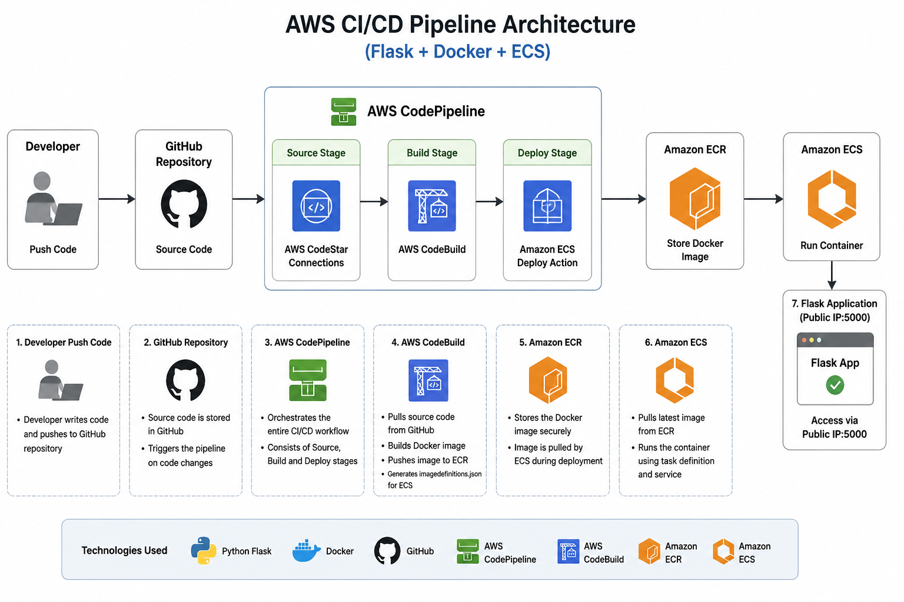

# AWS CI/CD Pipeline Project (Flask + Docker + ECS)

## Architecture Diagram


)


---
## Project Overview

This project demonstrates a complete CI/CD pipeline using AWS services to automate the build and deployment of a containerized Python Flask application.

The Flask application was containerized using Docker and deployed to Amazon ECS through a fully automated CI/CD pipeline using GitHub, AWS CodePipeline, and AWS CodeBuild.

This project helped me understand end-to-end CI/CD workflows, container deployment, load balancing, monitoring, scaling, and troubleshooting real AWS deployment issues.

---

## Architecture Flow

Developer Push Code
↓
GitHub Repository
↓
AWS CodePipeline
↓
AWS CodeBuild
↓
Docker Image Build
↓
Amazon ECR
↓
Amazon ECS (Fargate)
↓
Application Load Balancer (ALB)
↓
Users
↓
CloudWatch Monitoring
↓
Auto Scaling

---

## Technologies Used

* Python Flask
* Docker
* GitHub
* AWS CodePipeline
* AWS CodeBuild
* Amazon ECR
* Amazon ECS (Fargate)
* Application Load Balancer (ALB)
* Amazon CloudWatch
* ECS Service Auto Scaling

---

## Deployment Workflow

1. Source code is pushed to GitHub
2. AWS CodePipeline detects code changes
3. AWS CodeBuild starts automatically
4. Docker image is built using Dockerfile
5. Docker image is pushed to Amazon ECR
6. Amazon ECS pulls the latest image
7. ECS deploys the container
8. ALB routes traffic to ECS tasks
9. Application becomes accessible through ALB DNS

---

## Buildspec Workflow

The build process is defined inside `buildspec.yml`.

### pre_build

* Authenticate Docker with Amazon ECR
* Prepare ECR repository URI
* Set Docker image tag

### build

* Build Docker image
* Tag Docker image

### post_build

* Push Docker image to ECR
* Generate `imagedefinitions.json`

### artifacts

* Export `imagedefinitions.json`
* Pass artifact to Deploy stage

---

## Project Structure

```bash
.
├── app.py
├── Dockerfile
├── requirements.txt
├── buildspec.yml
├── screenshots/
│   ├── aws-cicd-architecture.png
│   ├── pipeline-success.png
│   ├── deploy-troubleshooting.png
│   ├── alb-running-app.png
└── README.md
```

---

## AWS Services Used

### AWS CodePipeline

Automates the complete CI/CD workflow.

### AWS CodeBuild

Builds Docker images and prepares deployment artifacts.

### Amazon ECR

Stores Docker images securely.

### Amazon ECS (Fargate)

Runs containerized applications.

### Application Load Balancer

Distributes traffic across ECS tasks.

### Amazon CloudWatch

Monitors logs and service health.

### ECS Auto Scaling

Automatically scales tasks based on workload.

---

## Troubleshooting & Fixes

### 1. GitHub Source Connection Issue

**Issue:** GitHub connection failed.

**Fix:** Configured AWS CodeConnections.

**Result:** Source stage connected successfully.

---

### 2. ECR Repository Issue

**Issue:** Incorrect ECR URI in `buildspec.yml`.

**Fix:** Updated correct repository URI.

**Result:** Docker image pushed successfully.

---

### 3. Deploy Stage Failed

**Issue:** Deploy stage failed after build success.

**Root Cause:** Container name in `imagedefinitions.json` did not match ECS task definition.

**Fix:** Updated container name.

Example:

```json
[
  {
    "name": "aws-ci-demo-container",
    "imageUri": "<ECR_IMAGE_URI>"
  }
]
```

**Result:** Deployment succeeded.

---

### 4. ALB Access Issue

**Issue:** App not accessible via ALB DNS.

**Root Cause:** Security group rules incorrect.

**Fix:**

* ALB inbound port 80 enabled
* ECS task allowed ALB traffic on port 5000

**Result:** Application accessible successfully.

---

## Application Access

Application is accessible through ALB DNS:

```bash
http://<alb-dns-name>
```

---

## Screenshots

### Architecture Diagram

```markdown

```

### Pipeline Success

```markdown

```

### Deployment Troubleshooting

```markdown

```

### Application Running via ALB

```markdown

```

---

## Key Learnings

* Built end-to-end AWS CI/CD pipeline
* Learned Docker image creation and deployment
* Understood ECR and ECS integration
* Configured Application Load Balancer
* Implemented ECS Auto Scaling
* Monitored infrastructure using CloudWatch
* Practiced real-world troubleshooting

---

## Future Improvements

* Enable HTTPS using AWS Certificate Manager (ACM)
* Implement Blue/Green deployment
* Provision infrastructure using Terraform

---

## Project Status

✅ Project Completed Successfully

