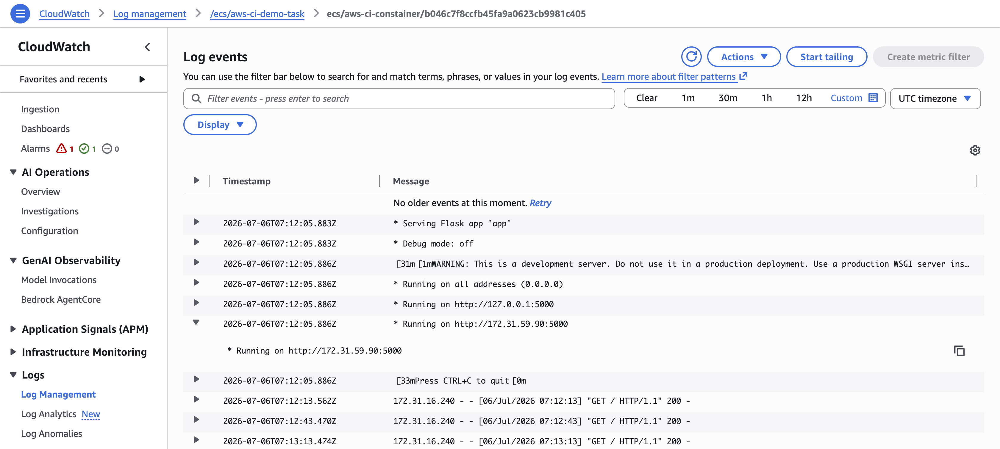
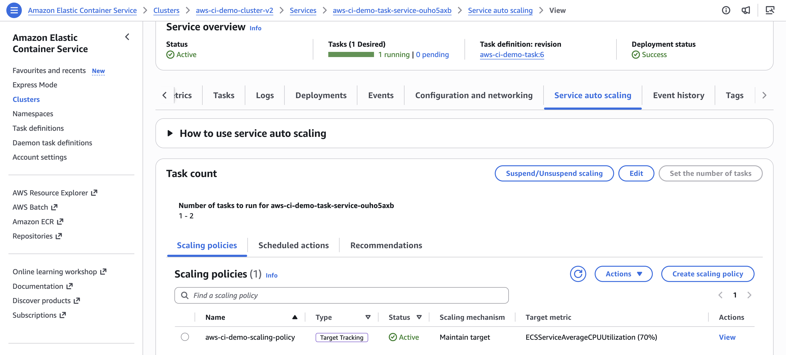

# AWS CI/CD Pipeline Project (Flask + Docker + ECS + ALB + Auto Scaling + CloudWatch)

## Project Overview

This project demonstrates a complete CI/CD pipeline using AWS services.

A simple Flask application was containerized using Docker and automatically deployed to Amazon ECS using AWS CodePipeline and AWS CodeBuild.

The project was enhanced by integrating an Application Load Balancer (ALB), Amazon CloudWatch monitoring, and ECS Auto Scaling to improve application availability, scalability, and observability.

The objective of this project was to gain hands-on experience in building an end-to-end CI/CD pipeline, containerizing applications with Docker, deploying applications on Amazon ECS, configuring an Application Load Balancer, implementing CloudWatch monitoring, enabling ECS Auto Scaling, and troubleshooting real-world AWS deployment issues.

---

## Architecture Diagram


___

## Architecture Flow

Developer Push Code  
→ GitHub Repository  
→ AWS CodePipeline  
→ AWS CodeBuild  
→ Docker Image Build  
→ Amazon ECR  
→ Amazon ECS Service (Launch Type: AWS Fargate)  
→ Application Load Balancer (HTTP:80)  
→ Flask Application  

### Monitoring & Auto Scaling

Amazon CloudWatch  
→ ECS Auto Scaling

---

## Technologies Used

- Python Flask
- Docker
- Git
- GitHub
- AWS CodePipeline
- AWS CodeBuild
- Amazon ECR
- Amazon ECS
- Application Load Balancer (ALB)
- Amazon CloudWatch
- ECS Auto Scaling

---

## Deployment Workflow

1. Developer pushes code to GitHub.
2. CodePipeline detects changes automatically.
3. Source code is sent to CodeBuild.
4. CodeBuild executes the buildspec.yml file.
5. Docker image is built.
6. Docker image is tagged.
7. Docker image is pushed to Amazon ECR.
8. imagedefinitions.json is generated.
9. Amazon ECS deploys the latest container image.
10. CloudWatch collects logs and metrics.
11. ECS Auto Scaling adjusts the number of running tasks.
12. Application Load Balancer routes traffic to healthy ECS tasks.
13. Users access the application using the ALB DNS endpoint.

---

## Buildspec Workflow

The CI/CD build process is defined in **buildspec.yml**.

### Pre Build

- Authenticate Docker with Amazon ECR
- Configure repository URI
- Configure image tag
- Prepare environment variables

### Build

- Build Docker image
- Tag Docker image

### Post Build

- Push Docker image to Amazon ECR
- Generate imagedefinitions.json
- Export deployment artifact

---

## Project Structure

```text
.
├── app.py
├── Dockerfile
├── requirements.txt
├── buildspec.yml
├── aws-cicd-architecture.png
├── screenshots/
│   ├── pipeline-success.png
│   ├── deploy-troubleshooting.png
│   ├── alb-dns-running-app.png
│   ├── cloudwatch-flask-app-logs.png
│   └── ecs-autoscaling.png
└── README.md
```

---

## Docker Build Process

The application is containerized using Docker.

### Dockerfile Responsibilities

- Uses Python base image
- Copies application files
- Installs dependencies
- Exposes application port
- Starts the Flask application

---

## AWS Services Used

### AWS CodePipeline
Automates the complete CI/CD workflow from source to deployment.

### AWS CodeBuild
Builds the Docker image using `buildspec.yml` and prepares deployment artifacts.

### Amazon ECR (Elastic Container Registry)
Stores Docker container images securely and provides versioned image management.

### Amazon ECS (Elastic Container Service - Fargate)
Runs the containerized Flask application without managing servers.

### Application Load Balancer (ALB)
Distributes incoming HTTP traffic across healthy ECS tasks and ensures high availability.

### Amazon CloudWatch
Collects logs, monitors ECS CPU/memory metrics, and provides observability for the application.

### ECS Auto Scaling (Application Auto Scaling)
Automatically scales ECS tasks based on CloudWatch metrics such as CPU utilization to handle load efficiently.


---

## Troubleshooting & Fixes

### 1. GitHub Source Configuration Issue

**Issue**

GitHub Version 2 was not visible during pipeline creation.

**Fix**

Configured GitHub connection using AWS CodeConnections.

**Result**

Pipeline source stage was successfully configured.

---

### 2. Deploy Stage Failed

**Issue**

Source and Build stages completed successfully but Deploy stage failed.

**Root Cause**

The container name inside `imagedefinitions.json` did not match the ECS task definition.

**Fix**

Updated the container name inside `imagedefinitions.json` to match the ECS task definition.

Example:

```json
[
  {
    "name": "aws-ci-demo-container",
    "imageUri": "<ECR_IMAGE_URI>"
  }
]
```

**Result**

Deployment completed successfully.

---

### 3. ECR Repository Configuration Issue

**Issue**

Confusion while adding the correct Amazon ECR repository URI in `buildspec.yml`.

**Fix**

Configured the correct Amazon ECR repository URI and image tagging.

**Result**

Docker image was successfully pushed to Amazon ECR.

---

### 4. Deploy Stage Took Longer Than Expected

**Issue**

The Deploy stage remained in progress for several minutes.

**Root Cause**

Amazon ECS waits for the new task to become healthy and for the service to reach a steady state before completing the deployment.

**Fix**

- Verified ECS task status was **RUNNING**
- Checked ECS service events
- Confirmed deployment status

**Result**

Deployment completed successfully after the service reached a steady state.

---

### 5. Application Load Balancer Access Issue

**Issue**

The application was not accessible using the ALB DNS endpoint.

**Root Cause**

The ALB Security Group did not allow inbound HTTP traffic on port 80.

**Fix**

- Allowed inbound HTTP (port 80) from `0.0.0.0/0`
- Verified ALB listener configuration
- Verified target group health
- Confirmed ECS tasks were healthy

**Result**

The application became accessible through the ALB DNS endpoint.

---

## Application Access

The application was successfully accessed using the Application Load Balancer DNS.

Example:

```text
http://<alb-dns-name>
```

---

##Screenshots

## Pipeline Success


---

## Deployment Troubleshooting


---

## ALB Running Application


---

## CloudWatch Logs (Flask App)



---

## ECS Auto Scaling



---

## Key Learnings

- Built an end-to-end AWS CI/CD pipeline.
- Containerized applications using Docker.
- Deployed applications on Amazon ECS.
- Integrated Amazon ECR with ECS.
- Configured an Application Load Balancer.
- Implemented CloudWatch monitoring.
- Configured ECS Auto Scaling.
- Gained hands-on experience troubleshooting AWS deployment issues.

---

## Future Improvements

- Enable HTTPS using AWS Certificate Manager (ACM)
- Configure a custom domain with Amazon Route 53
- Implement Blue/Green deployments using CodeDeploy

---

## Project Status

**Project completed successfully.**
